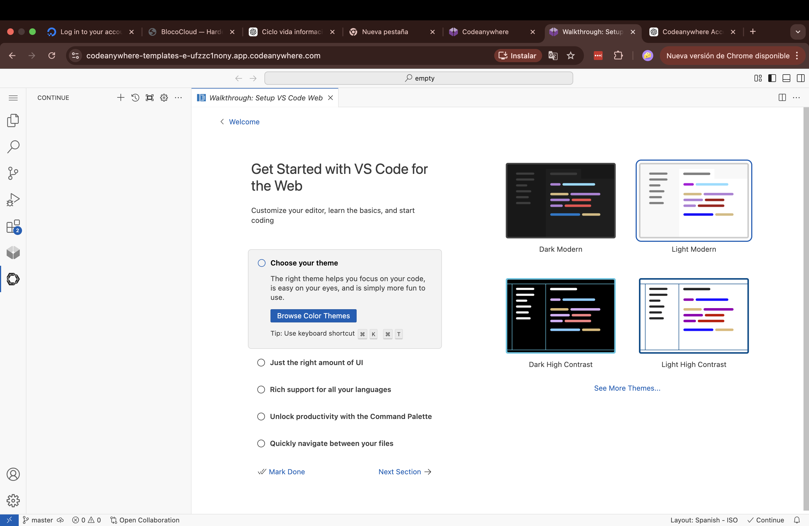
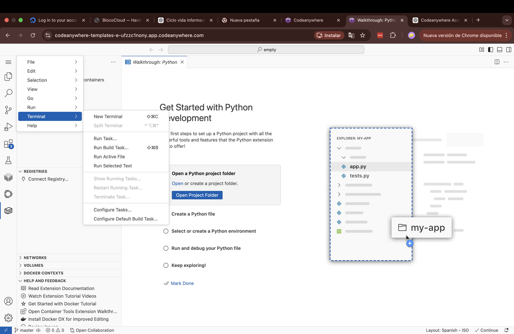
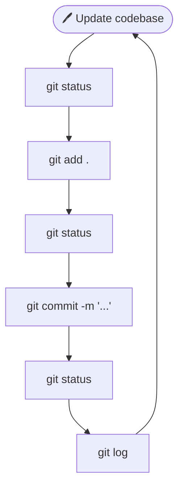
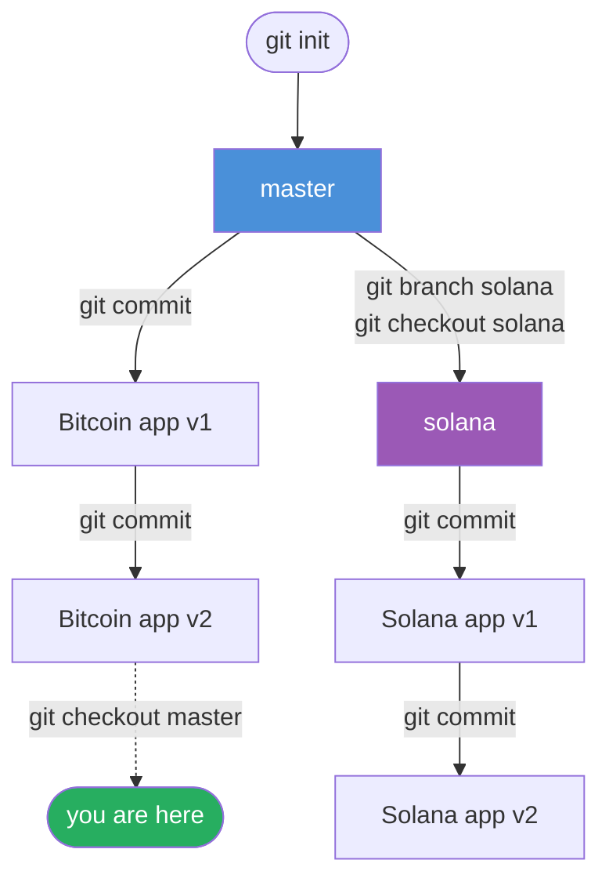

# 🧑‍💻 Git Crash Course

**Duration:** ~45 minutes | **Level:** Complete beginner  
**What you'll learn:** Create a repo, track changes with commits, and work with branches — the core Git workflow used by every developer.

---

## 1. 🌐 Create a Codeanywhere Account `~5 min`

Go to [codeanywhere.com](https://codeanywhere.com) and sign up.  
Use email + password or Google login.

---

## 2. 🗂️ Create an Empty Workspace `~10 min`

1. Click the **New +** button.
2. Under **Git repository**, select `Codeanywhere-Templates/empty`.
3. Type a name for your workspace and confirm.

> ⏳ The workspace takes about 10 minutes to spin up. When it's ready it looks like this:



---

## 3. 💻 Open a Terminal `~1 min`

Go to the **burger menu** (top left) → **Terminal** → **New Terminal**.



---

## 4. ⚙️ Configure Git `~2 min`

Tell Git who you are so your changes are signed with your name.

Check your current config:
```bash
git config --global user.name
git config --global user.email
```

Set your name and email:
```bash
git config --global user.name "Your Name"
git config --global user.email "your@email.com"
```

---

## 5. 🗃️ Create Your First Repository `~5 min`

> 💡 **Concept:** A **repository (repo)** is a project folder that Git tracks. `git init` creates a hidden `.git` folder where Git stores its entire history.

Create a new project folder and initialize Git inside it:
```bash
mkdir cryptotrading
cd cryptotrading
git init
```

Create your first file:
```bash
touch README.md
```

Open `README.md` and add this text:
```
This is the first version of my cryptotrading app.
```

Now save your first **snapshot**:
```bash
git status
git add .
git status
git commit -m "First version of my cryptotrading app"
git status
git log
```

> 🔁 From here on, every time you make changes to your code you'll repeat this exact workflow:

> 💡 **The core workflow:** always check status before and after staging, then commit. You'll use this loop constantly.



---

## 6. 🤖 Build the App & Create a New Commit `~10 min`

Create the app file:
```bash
touch app.py
```

Open a new ChatGPT window and send this prompt:

> *Single app.py script: FastAPI server that serves a static HTML/JS page graphing Bitcoin price for the last 30 days, with a nice UI. Dependencies must be exactly: `pip install fastapi uvicorn requests`. Run command: `uvicorn app:app`.*

Paste ChatGPT's output into `app.py`, then install dependencies and run the server:
```bash
pip install fastapi uvicorn requests
uvicorn app:app
```

Open the preview URL in your browser to see your app. Press `Ctrl+C` to stop the server.

Commit your work:
```bash
git add .
git commit -m "Bootstrapped first version of web server"
git log
```

---

## 7. 🌿 Create a New Branch `~7 min`

> 💡 **Concept:** A **branch** is a parallel version of your project. You can experiment on a branch without touching the original code.



Create and switch to a new branch called `solana`:
```bash
git branch solana
git checkout solana
```

Open a **new** ChatGPT window, paste the contents of `app.py`, and send:

> *Update this to graph Solana instead of Bitcoin. Return the full script.*

Replace the contents of `app.py` with ChatGPT's output, then run the server to verify:
```bash
uvicorn app:app
```

Commit the new version:
```bash
git add .
git commit -m "Added Solana chart"
```

---

## 8. ↩️ Switch Back to Master `~2 min`

> 💡 **Concept:** `git checkout` lets you jump between branches. Your files will literally change to match the branch you switch to.

```bash
git checkout master
uvicorn app:app
```

You're back to the Bitcoin version. The Solana code is safely stored in the `solana` branch.

---

## 📋 Cheat Sheet

| Command | What it does |
|---|---|
| `git init` | Start tracking a folder with Git |
| `git status` | Show what has changed |
| `git add .` | Stage all changes for the next commit |
| `git commit -m "msg"` | Save a snapshot with a message |
| `git log` | View commit history |
| `git branch <name>` | Create a new branch |
| `git checkout <name>` | Switch to a branch |
